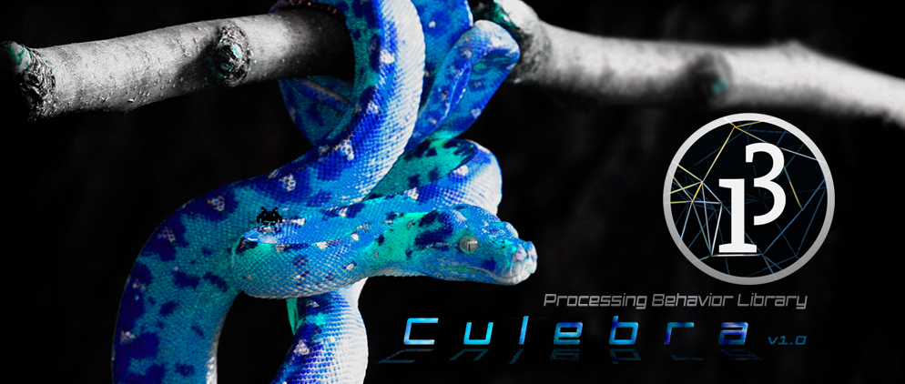
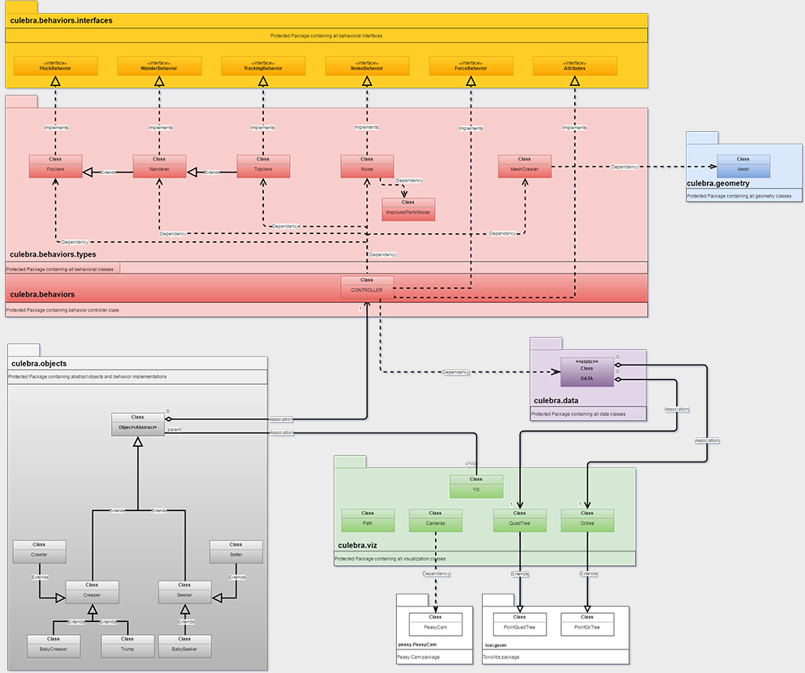

#### CULEBRA LIBRARY FOR PROCESSING INTRODUCTION ####
A collection of objects and behaviors for creating dynamic multi agent interactions.
2D|3D Multi Object Behavior library focused on hybrid system interactions with custom Visualization, Data, and performance features.

#####There are 6 Major Types of Behaviors which can be hybridized anyway your heart desires.#####
* Flocking Behavior - Flockers Behavior Type Class Implements Flock Behavior Interface
* Wandering Behavior - Wanderer Behavior Type Class Implements Wander Behavior Interface, the base Wander behavior is from Craig Reynolds and Daniel Shiffman.
* Noise Behavior - Improved Perlin Noise Behavior Type Class Implements Noise Behavior Interface. 
* Tracking Behavior - Path, Shape and multiShape Tracker Behavior Type Class Implements Tracking Behavior Interface. 
* BabyMakers Behavior - Objects can spawn children under the right conditions. Objects can have type specific behaviors. For example, if you are a "Parent" object or object of type Creeper or Seeker or you derrive from these classes then you can create children, however if you are of type BabyX then you no longer have the capability to spawn children.
* Mesh Crawler - Mesh Crawler Behavior Class. 
* Forces – Attract, Repel and other force methods inside the controller class.

#####The Controller#####
* Controller Class - this is the class which acts as controller for all behaviors classes. This class also builds on behaviors, using image drivers and other features which are not in the stock behavior classes. The Abstract Object class mentioned below contains and instance of this class (controller contains instance of all behaviors), and since all other objects derrive from this class the controller is there to provide a global controlling mechanism. See Class Diagram for more details.

#####There are currently 5 types of objects you can inherit from or implement their default attributes.#####
* Object - Abstract class from which other objects can inherit from. Both Creepers & Seekers extend this class. This class also has the instances of the controller and vizualization classes required to run these objects. This class declares the basic abstract methods which must be implemented by any class which derrives from it.
* Creeper - Creeper Objects are the main implementation of the abstract Objects. They are able to implement any type of behavior and are meant as a do all type of object.
* Seekers - Seeker Objects are the technically also main implementation of the abstract Objects, like Creeper Objects, they poses the same capabilities. They are able to implement any type of behavior but are meant to be used as Objects which "Seek" other objects. They should be used in conjunction with behaviors.trailFollowing Methods. I have not restricted their behavior implementations at this stage but might do so in the future to make certain behaviors more Object type specific.
* BabyCreeper - Baby Creeper class which inherits from the Creeper Class - Object is meant to be used as a child of the Creeper Object 
* BabySeeker - Baby Seeker class which inherits from the Seeker Class - Object is meant to be used as a child of the Seeker Object 

#### RELEASES ####

#####Culebra 1.0 - Requires Processing 3.1.1#####
* View the [Release Notes](http://www.culebra.technology/culebra-1/index.html#download) and [JavaDoc API Documents](http://culebra.technology/culebra-1/reference/index.html)
* [Download Culebra 1.0](http://www.culebra.technology/culebra-1/index.html#download) 

#### WAYS TO USE CULEBRA ####
* Use the Culebra Objects and Controller (Recommended) [Demo Files](http://www.culebra.technology/culebra-1/index.html#examples)
* Create your own objects and simply implement behavior classes individually. [See File](http://www.culebra.technology/culebra-1/examples/CustomObject_with_ImportedBehaviors/CustomObject_with_ImportedBehaviors.pde)
* Create your own objects and inherit from Culebra Objects. This will provide access to the controller and all classes. [See File](http://www.culebra.technology/culebra-1/examples/CustomObject_Polymorphism_III/CustomObject_Polymorphism_III.pde)

#####For more specific details see the Class Diagram Below####

#### CLASS DIAGRAMS ####

##### CREDITS #####

* Thanks to Craig Reynolds for all of his work on boid behavior
* Big thanks to Daniel Shiffman, his work has been very inspirational and referenced in this library.
